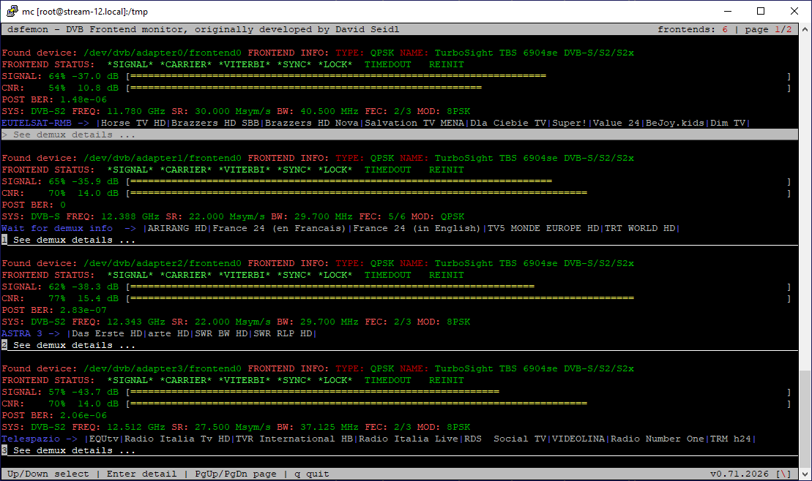

# 📡 dsfemon

> A terminal-based DVB frontend monitor for Linux. It can be used as a more capable alternative to the basic `femon` tool from the `dvb-apps` package, especially on systems with many DVB frontends. `dsfemon` is designed for quick operational overview of tuner state, signal quality, tuning parameters, and service information in multistream backend environments, including IPTV backends.



## 🎯 Overview

`dsfemon` is a fork and modernized continuation of the original Femon DVB frontend monitor developed by David Seidl in 2012.

It shows a compact live overview of DVB tuner state in a terminal UI and is intended for quickly checking frontend lock state, signal quality, DVB tuning parameters, and basic demux/service information from Linux DVB devices.

## ✨ Features

- scans Linux DVB frontend devices under `/dev/dvb`
- displays frontend type, name, and lock/status flags
- shows signal and CNR/SNR values with terminal bars
- reads modern DVBv5 properties when available
- keeps legacy DVB ioctl fallbacks for signal and SNR bars
- displays DVB delivery system, frequency, bandwidth, symbol rate, FEC, and modulation
- reads basic NIT/SDT demux information and shows network/service names
- supports paging when many frontends are present
- provides keyboard navigation and a placeholder demux detail screen

## ⌨️ Controls

| Key | Action |
| --- | --- |
| `Up` / `Down` | select frontend detail row |
| `PgUp` / `PgDn` | switch page |
| `Enter` | open demux detail placeholder |
| `Esc` | return from detail view |
| `q` | quit |

## 📦 Requirements

- Linux with DVB device support
- C++ compiler with C++11-era system headers
- `make`
- `pkg-config`
- `libncurses-dev` / `ncursesw`
- Linux DVB headers, usually provided by the system libc/kernel headers package

Debian/Ubuntu example:

```bash
sudo apt install build-essential pkg-config libncurses-dev
```

Optional cleanup on systems that previously used the old ncurses development package:

```bash
sudo apt remove libncurses5-dev
```

## 🔨 Building

```bash
make clean
make
```

The resulting binary is:

```text
./dsfemon
```

## ▶️ Running

Start the monitor with the default broad adapter scan:

```bash
./dsfemon
```

Additional commands and useful arguments:

```bash
# Show command-line help
./dsfemon --help

# Show version
./dsfemon --version

# Scan only selected adapters
./dsfemon --adapters 0,2

# Limit the number of frontends scanned per adapter
./dsfemon --subadapters 1
```

## 🗂️ Project Structure

```text
/
├── docs/
│   └── screenshots/
│       └── dsfemon-main.png   # main application screenshot
├── dsfemon.cpp                # main ncurses loop, paging, keyboard handling
├── command_line.*             # command-line options
├── device_discovery.*         # DVB device scanning and lifecycle
├── frontend_monitor.*         # DVBv5 property collection
├── frontend_status.*          # frontend status snapshot collection
├── frontend_view.*            # frontend/status rendering
├── demux_reader.cpp           # background PAT/PMT/NIT/SDT section reader
├── demux_snapshot.cpp         # stable demux data copied for UI rendering
├── demux_view.*               # demux/service summary rendering
├── si_parser.cpp              # PSI/SI parser helpers
├── *_table.h                  # small PSI/SI table constants
├── ui_helpers.*               # shared ncurses rendering helpers
├── ncurses_present.*          # terminal bar helpers
└── color.*                    # ncurses color pairs/macros
```

## Status

- ✅ modern build against `ncursesw`
- ✅ default adapter scan starts at adapter `0`
- ✅ DVBv5 properties are read individually for better compatibility with older drivers
- ✅ paging and keyboard navigation are implemented
- ✅ demux detail navigation is prepared, but the detailed service/PMT view is still planned

## 🙏 Acknowledgements

Special thanks to David Seidl, author of the original Femon DVB frontend monitor from 2012.

This project is based on his original work and continues it as a modernized open-source version for current Linux DVB systems.

## License

Permission was granted to continue and publish the project under the condition that open-source principles are preserved.

A standard open-source license should be added once the exact license choice is confirmed.
